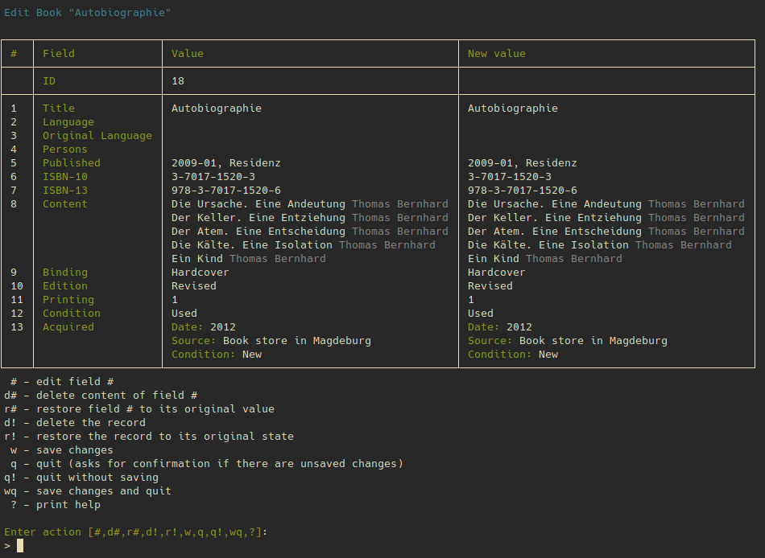

# Myshelf

Myshelf is a CLI book management software written in PHP.

It is based on [Laravel Zero](https://laravel-zero.com/) and [SleekDB](https://github.com/rakibtg/SleekDB).

It's still in development. There's no stable release, yet.

## Motivation

I don't like graphical applications and didn't find any satisfying software for managing my books.

## Requirements

I use Linux, so I don't know if it works with Windows.

-   [PHP 8.1](https://www.php.net/)
-   [Composer](https://getcomposer.org/)

## Installation

```sh
git clone https://github.com/stefanszymanski/myshelf.git
cd myshelf
composer install
```

## Usage

Change to the project directory and type `./myshelf` to see a list of available commands.

A description of each command is available via `./myshelf [command] --help`.

Supported query fields and filters of the list command `./myshelf ls [table]` is available via  `./myshelf desc [table]`.

## Features

-   [x] Store data as json files (using [SleekDB](https://github.com/rakibtg/SleekDB))
-   [x] Manage records
    -   [x] Add
        -   [x] via TUI
        -   [ ] via CLI
    -   [x] Edit
        -   [x] via TUI
        -   [ ] via CLI
    -   [x] List
        -   [x] query specific fields
        -   [x] sorting
        -   [x] filters
        -   [x] grouping
        -   [ ] different output formats (currently only fancy tables)
    -   [ ] Delete (wip)
    -   [ ] Display a single record (wip)
    -   [ ] Display availabe query fields and filters for the list command (wip)
-   [x] Datatypes
    -   [x] Persons (name, nationality)
    -   [x] Publishers
    -   [x] Books
        -   [x] Basic fields: title, publishing date, ISBN
        -   [x] Associated persons: authors, editors
        -   [x] Associated publisher
        -   [x] Binding (e.g. hardcover, paperback)
        -   [x] Acquiration data: date, vendor/person, condition
        -   [ ] Type of content (e.g. novel, nonfiction, drama etc)
        -   [ ] Multiple contents (e.g. anthologies with multiple novels from different authors)
    -   [ ] Book lists (e.g. for grouping volumes of complete works)
    -   [ ] Tagging?
-   [ ] User configuration (e.g. data storage directory, disabling specific features)
-   [ ] Data schema versioning to allow automatic and reliable updates of records when data types change
-   [ ] ISBN barcode scanning via webcam (using [Zbar](http://zbar.sourceforge.net/))
-   [ ] Retrieval of book data via ISBN using web services
-   [ ] Git integration for versioning the data
-   [ ] Autocompletion for bash and zsh
-   [ ] Localization (meh...)


## Screenshots



